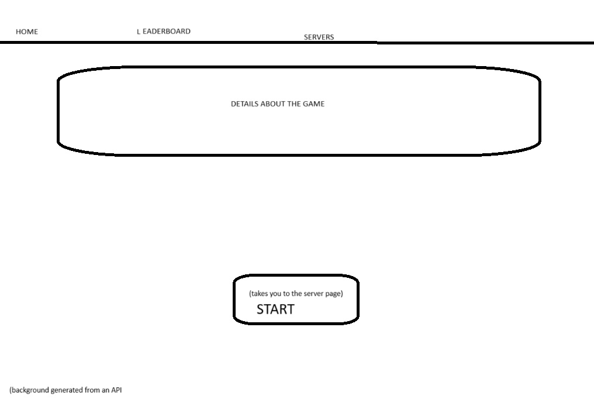
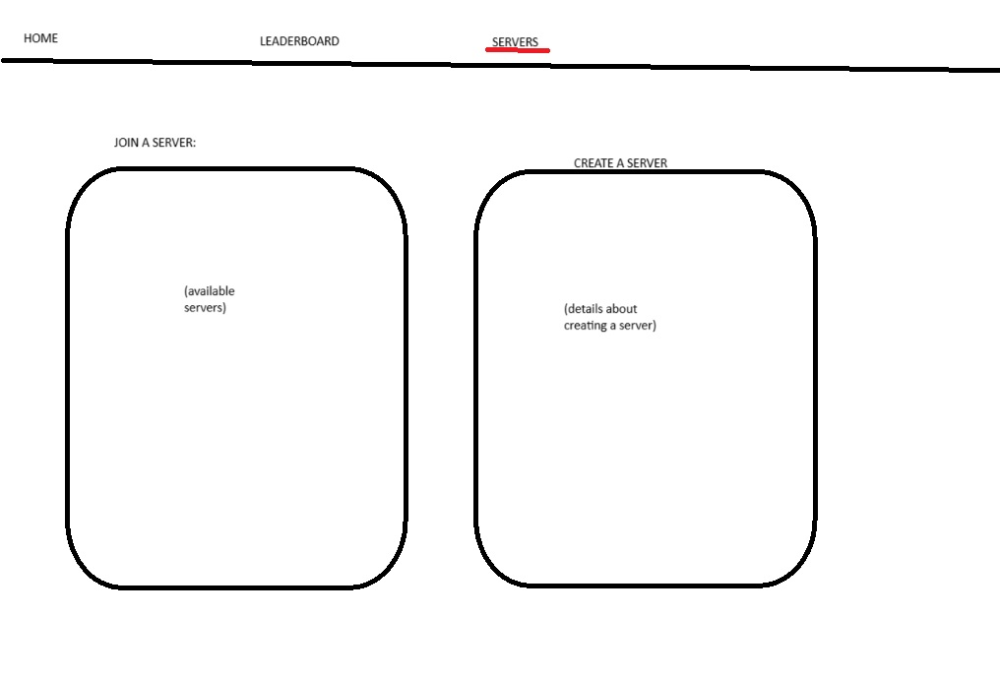
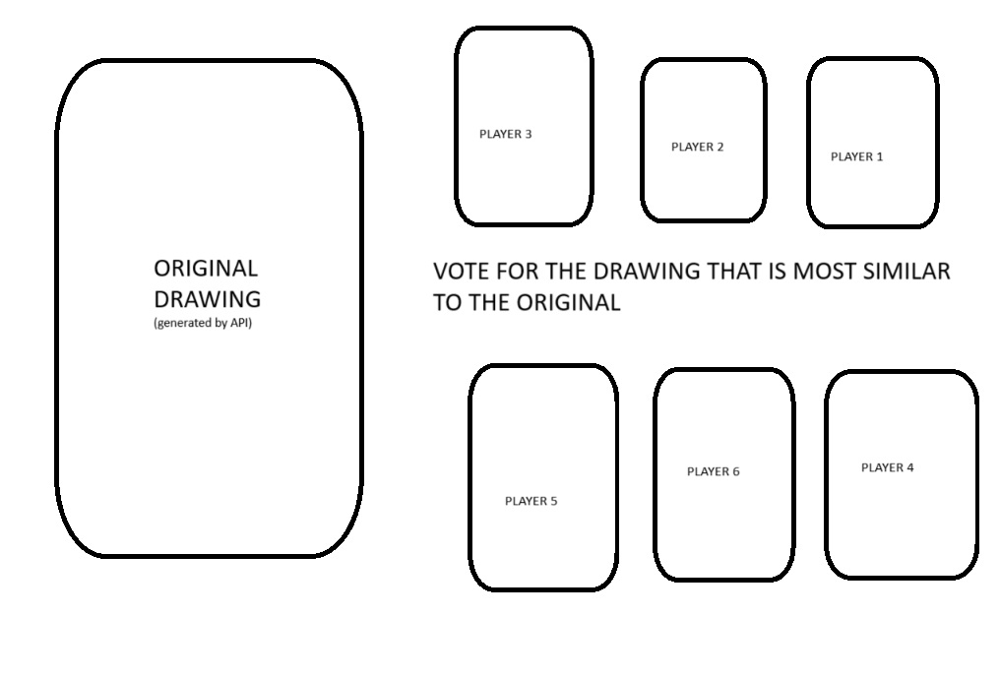

# In A Blink

## Elevator Pitch
**In A Blink** is a fast-paced, multiplayer drawing game that tests both creativity and memory. Imagine catching a quick glimpse of an image, and then racing against the clock to recreate it from memory—competing with friends or other players online. After the drawing phase, everyone votes on the most accurate or creative rendition. It’s fun, competitive, and endlessly replayable, with randomized images keeping each round fresh. "In A Blink" combines real-time interaction and playful competition, making it the perfect game for casual gamers and drawing enthusiasts alike!

## Key Features
- **Multiplayer Drawing Game**: Compete with 3 or more players in each game.
- **Memory-Based Challenge**: Players are shown an image for a few seconds, then must draw it from memory before the timer runs out.
- **Voting System**: After the drawing phase, players vote on the best recreation based on accuracy or creativity.
- **Leaderboard**: Tracks player wins and scores across multiple games.
- **Randomized Images**: Each round, a new image is randomly pulled from an external API to keep the game exciting.
- **Real-Time Gameplay**: Players are synchronized in real time during the image reveal, drawing phase, and voting process via WebSockets.

## Technology Breakdown

### HTML
- **Usage**: The core structure of the game is built using HTML. The drawing canvas, image display area, timer, and voting sections are all HTML elements that create the layout.
  
### CSS
- **Usage**: CSS styles the game’s interface, ensuring a clean and visually appealing design. Animations and transitions are used to create smooth phase shifts between image viewing, drawing, and voting. It also handles responsiveness, so the game looks great on different screen sizes.

### JavaScript
- **Usage**: JavaScript controls game logic and interactivity. This includes managing timers, enabling drawing on the canvas, and handling the submission of drawings and votes. JavaScript is responsible for loading the image, managing rounds, and updating the interface based on real-time events.

### React
- **Usage**: The game uses React to build a **single-page application (SPA)**, managing different game states (viewing, drawing, voting) using React components. React allows for dynamic updates to the interface without refreshing the page, offering a seamless user experience.

### WebSockets
- **Usage**: WebSockets ensure real-time synchronization between all players. The image is displayed to all players at the same time, and drawing submissions are broadcast instantly. WebSockets also manage real-time voting and leaderboard updates during and after each game round.

### Web Service (API)
- **Calling Web Services**: "In A Blink" fetches images for each round using the **Unsplash API** or **Lorem Picsum** to ensure a fresh set of visuals for players to recreate.
  - Example: The server makes a request to the Unsplash API for a random image, which is then displayed to all players for a limited time.
  
- **Providing Web Services**: A custom API is used to save drawings, track player scores, and manage user profiles. Data from the game (like drawing submissions and voting results) is sent to and stored in a backend database.
  - Example: The `/api/saveDrawing` endpoint stores completed drawings for each player.

### Authentication
- **Usage**: Authentication via email and password. Players must log in to play, allowing for personalized game experiences and tracking of individual scores. Tokens (JWT) are used to authenticate users during gameplay, ensuring secure sessions.

### Database
- **Usage**: A database that would store user profiles, match history, player scores, and drawings. This persistent storage allows users to revisit old matches, and maintains leaderboards across multiple game sessions.
  - Example: When a player finishes a game, their drawing is saved in the database, and their performance is logged for the leaderboard.

### WebSockets
- **Usage**: WebSockets power the game's real-time interaction. They are used to:
  - Broadcast the random image to all players at the same time.
  - Synchronize player actions during the drawing phase and allow all drawings to be submitted simultaneously for voting.
  - Broadcast voting results and update the leaderboard in real time.

## Sketches of Application
Below are rough sketches of the **"In A Blink"** application, showing the game flow:

### Main Game Interface

*This is where users see the rules and startup*

*This is the page where users join or host a server for the game*

### Voting Phase Interface

*After all players submit their drawings, everyone votes on the most accurate or creative recreation.*

----------------------------------------------------------------------------------------------------------------------------------------------------

## HTML deliverable
For this deliverable I built out the structure of my application using HTML.

- [x] **HTML pages** - Four HTML pages: homepage(login and gallery), Leaderboard, Play (host and join servers to play), and About (gives a showrt summary of the game).
- [x] **Links** - The login/home page is linked to all other pages. The Play page has links to a drawing page, and voting page. (these pages will later show up after starting a game)
- [x] **Text** - Placeholder text is used to explain how the game works and guide users through the game’s features, such as hosting or joining a game, and viewing player scores.
- [x] **Images** - Currently, the game page contains placeholders for images, which will eventually pull from a third-party image service. 
- [x] **Login** - Input box and submit button for login(username). In the future, player data, like scores and past drawings, will be pulled from the database.
- [x] **WebSocket** - Placeholders exist on the game page for WebSocket data, which will be used to sync real-time drawing actions and game updates between players.
